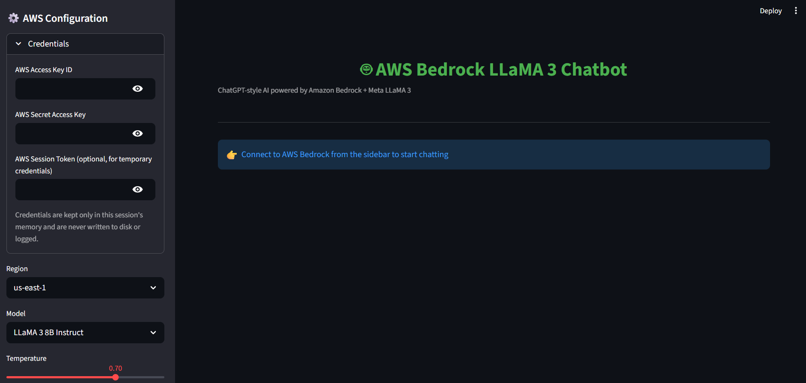
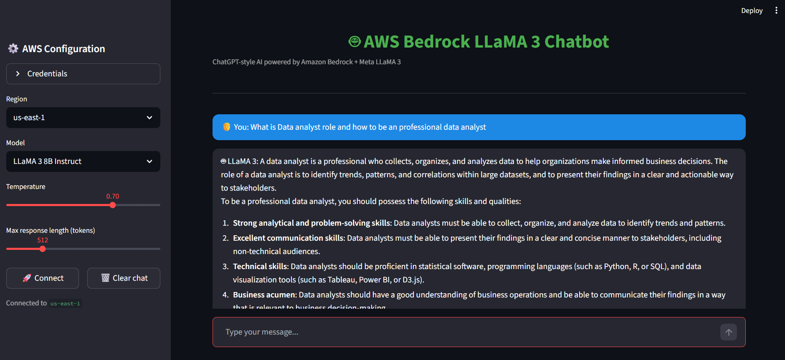

# 🤖 AWS Bedrock LLaMA 3 Chatbot

A ChatGPT-style conversational interface built with **Streamlit**, powered by **Meta LLaMA 3** models served through **Amazon Bedrock's** `InvokeModel` API. Connect with your own AWS credentials, pick a model, and start chatting - all within a clean, dark-themed UI.


---

## ✨ Features

- **Conversational UI** - ChatGPT-style chat bubbles with a dark, modern theme
- **Model Selection** - Switch between LLaMA 3 8B Instruct and LLaMA 3 70B Instruct
- **Adjustable Inference Parameters** - Fine-tune `temperature` and `max_tokens` via sidebar sliders
- **Session-Only Credentials** - AWS keys are held in memory for the session only; never written to disk or logged
- **Multi-Turn Context** - Full conversation history is formatted into LLaMA 3's native chat template so the model retains context across turns
- **Region Selection** - Choose between `us-east-1` and `us-west-2`
- **Error Handling** — Friendly error messages for missing credentials, connection failures, and Bedrock API errors
- **One-Click Reset** — Clear chat history at any time from the sidebar

---

## 🖼️ Preview

| Connected State | Config Panel | Chat Example |
|:---:|:---:|:---:|
|  |  |  |
| AWS session connected and ready | Sidebar credential & model configuration | Live conversation with LLaMA 3 |

---

## 🏗️ Architecture

```
┌─────────────────┐      boto3 (bedrock-runtime)      ┌──────────────────────┐
│  Streamlit UI    │ ─────────────────────────────────▶ │  Amazon Bedrock       │
│  (chat_app.py)   │ ◀───────────────────────────────── │  (LLaMA 3 8B / 70B)   │
└─────────────────┘        InvokeModel API response     └──────────────────────┘
```

1. User enters AWS credentials + selects a region/model in the sidebar
2. On **Connect**, a `boto3` session is created and a `bedrock-runtime` client is stored in Streamlit session state
3. User messages are appended to `chat_history` and formatted into the LLaMA 3 prompt template
4. The formatted prompt is sent to Bedrock via `invoke_model`
5. The generated response is parsed and rendered in the chat window

---

## 📋 Prerequisites

- Python 3.9+
- An AWS account with **Amazon Bedrock** access enabled in your target region
- Model access granted for `meta.llama3-8b-instruct-v1:0` and/or `meta.llama3-70b-instruct-v1:0` in the [Bedrock console](https://console.aws.amazon.com/bedrock/)
- AWS credentials (Access Key ID + Secret Access Key, and optionally a session token for temporary credentials) with `bedrock:InvokeModel` permission

---

## 🚀 Getting Started

### 1. Clone the repository

```bash
git clone https://github.com/Chowdri-Furkhan07/bedrock.git
cd bedrock
```

### 2. Create a virtual environment (recommended)

```bash
python -m venv venv
source venv/bin/activate      # On Windows: venv\Scripts\activate
```

### 3. Install dependencies

```bash
pip install -r requirements.txt
```

### 4. Run the app

```bash
streamlit run Bedrock_chatbot.py
```

The app will open automatically in your browser at `http://localhost:8501`.

### 5. Connect to Bedrock

1. Open the sidebar (**⚙️ AWS Configuration**)
2. Enter your **AWS Access Key ID** and **Secret Access Key** (and Session Token, if using temporary credentials)
3. Select a **Region** and **Model**
4. Adjust **Temperature** and **Max response length** as needed
5. Click **🚀 Connect**
6. Start chatting!

---

## 📦 Dependencies

| Package     | Version   | Purpose                              |
|-------------|-----------|---------------------------------------|
| `streamlit` | >=1.35.0  | Web UI framework                     |
| `boto3`     | >=1.34.0  | AWS SDK for Python (Bedrock client)  |
| `botocore`  | >=1.34.0  | Core AWS SDK functionality           |

---

## 🔐 Security Notes

- Credentials are stored only in Streamlit's in-memory `session_state` for the duration of the session
- No credentials are ever written to disk, cached, or logged
- For production use, consider using [AWS IAM roles](https://docs.aws.amazon.com/IAM/latest/UserGuide/id_roles.html), environment variables, or the [AWS credentials file](https://docs.aws.amazon.com/cli/latest/userguide/cli-configure-files.html) instead of pasting long-lived keys into the UI
- Grant only the minimum required IAM permission: `bedrock:InvokeModel`

---

## 🛠️ Configuration Options

| Setting              | Description                                                        | Default        |
|-----------------------|---------------------------------------------------------------------|-----------------|
| Region                | AWS region for the Bedrock endpoint                                 | `us-east-1`     |
| Model                 | LLaMA 3 8B Instruct or LLaMA 3 70B Instruct                          | 8B Instruct     |
| Temperature           | Controls response randomness/creativity (0.0–1.0)                   | `0.7`           |
| Max Tokens            | Maximum length of the generated response (64–2048)                  | `512`           |

---

## 📁 Project Structure

```
bedrock/
├── Bedrock_chatbot.py     # Main Streamlit application
├── requirements.txt       # Python dependencies
├── Screenshots/           # App preview images
└── LICENSE                # MIT License
```

---

## 🗺️ Roadmap

- [ ] Support for additional Bedrock models (Claude, Titan, Mistral, etc.)
- [ ] Persistent chat history (e.g., DynamoDB or local storage)
- [ ] Document/image upload for multimodal and RAG-style conversations
- [ ] Streaming responses for lower perceived latency
- [ ] Dockerfile for containerized deployment

---

## 🤝 Contributing

Contributions, issues, and feature requests are welcome! Feel free to check the [issues page](https://github.com/Chowdri-Furkhan07/bedrock/issues).

1. Fork the repository
2. Create a feature branch (`git checkout -b feature/amazing-feature`)
3. Commit your changes (`git commit -m 'Add some amazing feature'`)
4. Push to the branch (`git push origin feature/amazing-feature`)
5. Open a Pull Request

---

## 📄 License

This project is licensed under the **MIT License** — see the [LICENSE](./LICENSE) file for details.

---

## 👤 Author

**Chowdri Furkhan**
- GitHub: [@Chowdri-Furkhan07](https://github.com/Chowdri-Furkhan07)
- LinkedIn: [chowdri-furkhan](https://linkedin.com/in/chowdri-furkhan/)

---

*If you found this project useful, consider giving it a ⭐ on GitHub!*
